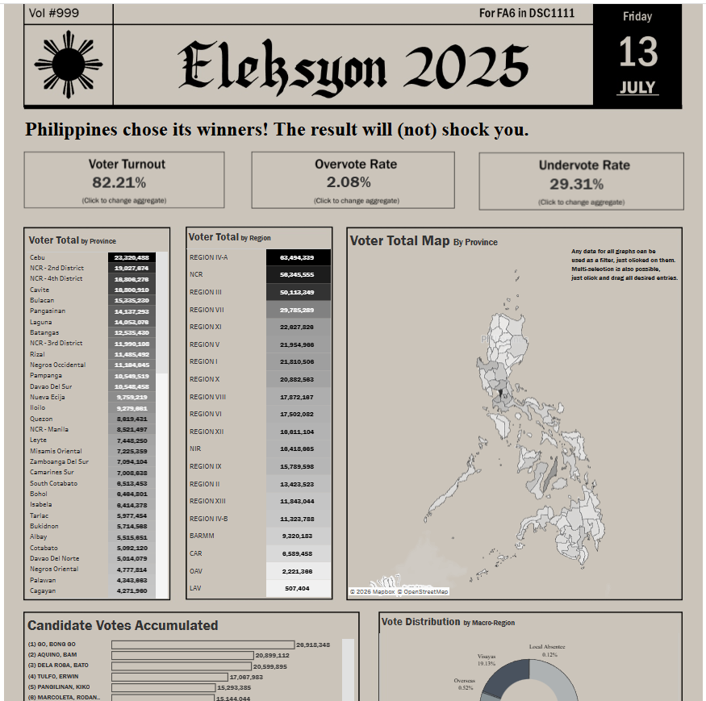
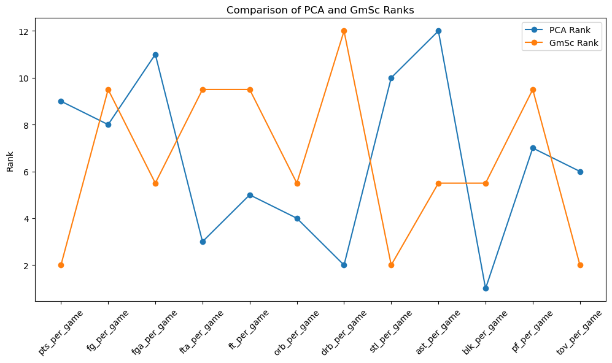
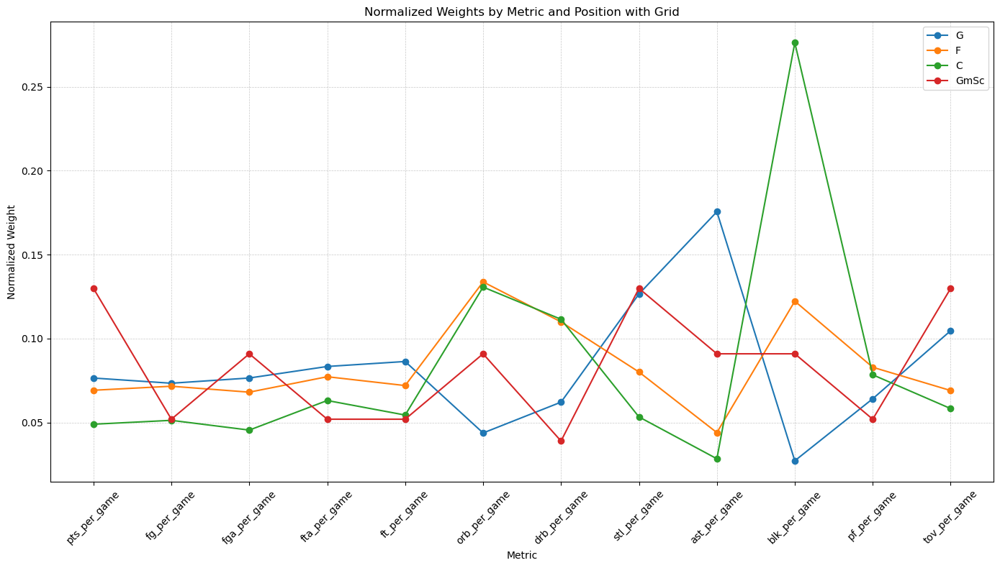
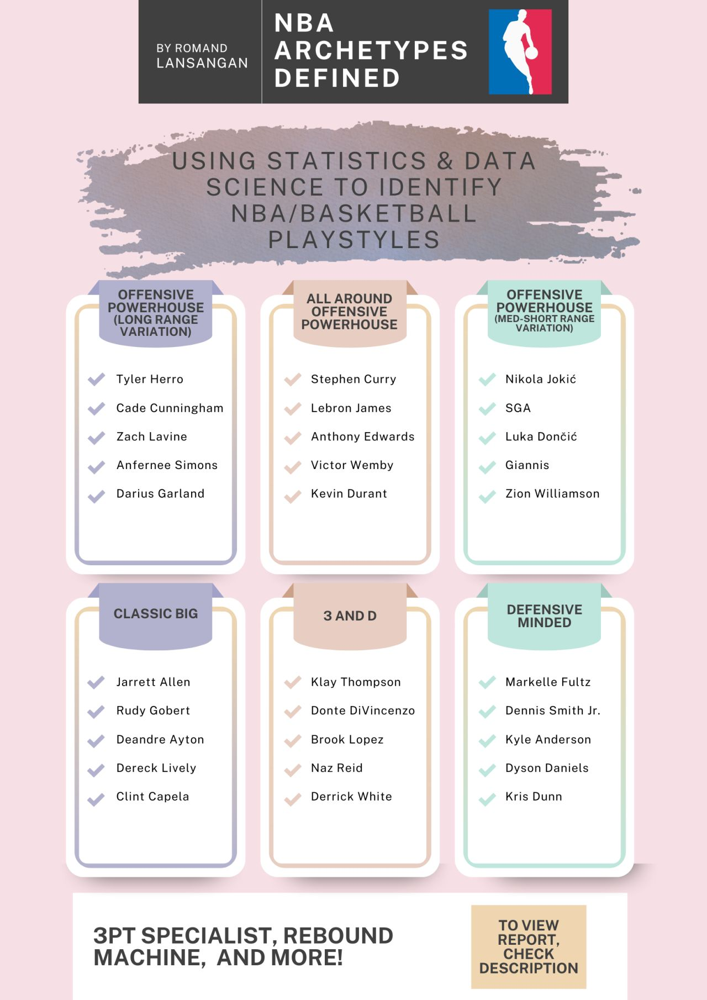
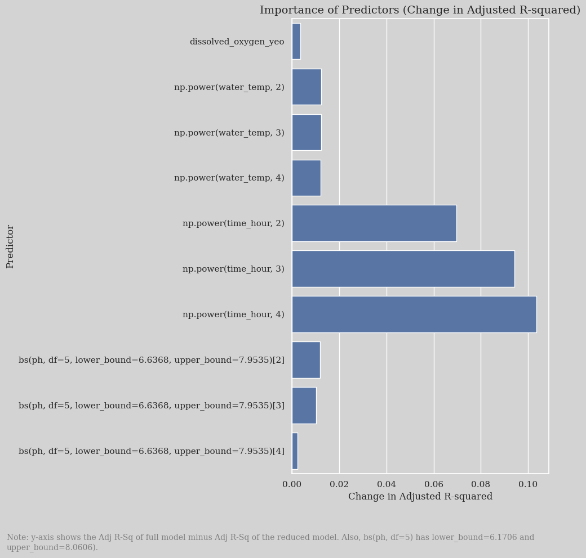
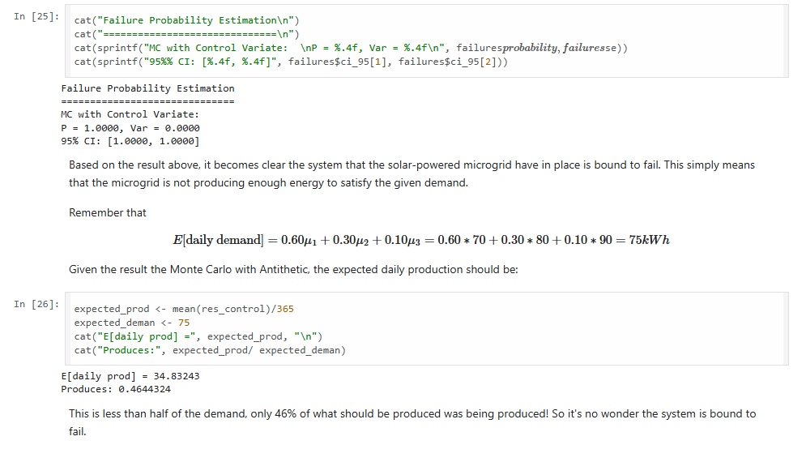
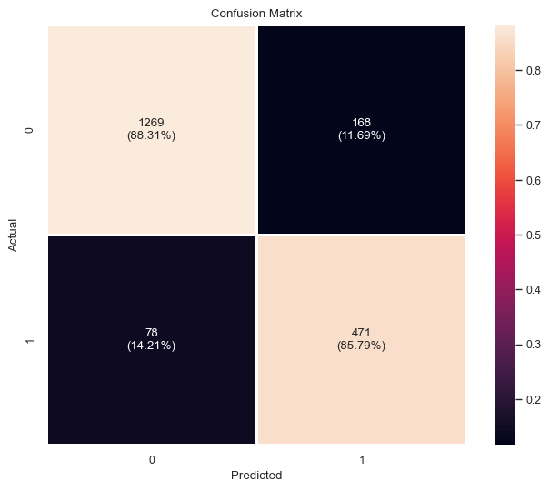
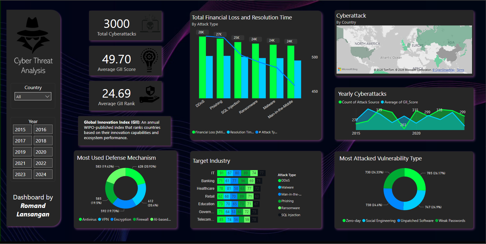

# Romand Lansangan

### Data Scientist | Data Engineer | Data Analyst

*Applied Mathematics graduate specializing in Data Science with hands-on experience in machine learning, statistical modeling, and data visualization.*

---

## Table of Contents

- [About Me](#about-me)
- [Education](#education)
- [Tech Stack](#tech-stack)
- [Featured Projects](#featured-projects)
  - [Tableau Portfolio](#tableau-portfolio)
  - [What Makes a Great NBA Player?](#what-makes-a-great-nba-player)
  - [NBA Archetypes Defined: Clustering Analysis](#nba-archetypes-defined-clustering-analysis)
  - [Harmful Algal Blooms: Chlorophyll-a Prediction](#harmful-algal-blooms-chlorophyll-a-prediction)
  - [Renewable Energy System Reliability](#renewable-energy-system-reliability)
  - [Churner Classifier](#churner-classifier)
  - [Cyber Threat Analysis Dashboard (2015-2024)](#cyber-threat-analysis-dashboard-2015-2024)
- [Experience](#experience)
- [Certifications](#certifications)
- [Connect With Me](#connect-with-me)

---

## About Me

I'm an Applied Mathematics (Data Science) student at Far Eastern University with diverse experience spanning machine learning, web development, statistical analysis, and data visualization. I have a demonstrated ability to lead technical teams, automate business processes, and build predictive models across multiple domains including sports analytics and environmental forecasting.

- Passionate about: Sports Analytics, Environmental Data Science, and Data Storytelling
- I love turning complex data into compelling visual stories
- Based in Quezon City, Philippines

---

## Education

**Bachelor's Degree in Applied Mathematics (Data Science Track)**  
Far Eastern University, Manila  
*October 2022 – Present*  

**Relevant Coursework:**
Probability & Distributions, Statistical Theory, Linear Algebra, Data Warehousing, Linear Models, Exploratory Data Analysis, Data Mining & Wrangling, Numerical Analysis, Operations Research, Advanced Calculus

---

## Tech Stack

**Programming Languages**

**Data Science & Machine Learning**

**Visualization & BI Tools**

**Web Development**

**Cloud & DevOps**

---

## Featured Projects

### Tableau Portfolio
> A collection of dashboards showcasing creativity and depth in data visualization

My personal favorite—interactive dashboards and data stories demonstrating competence in visual analytics.

View Dashboard Gallery

 

*2025 Philippine Election Result*

---

*Superstore Sales Dashboard*

---

*The Decline of Chicago's Taxi Industry (2014-2025)*

---

*Philippine Seismic Activity Dashboard*

---

### What Makes a Great NBA Player?
> Explanatory analysis using Principal Component Analysis

Utilized PCA to determine what separates great NBA players from average ones through statistical dimensionality reduction.

**Tech:** Python, PCA, Statistical Analysis

---

### NBA Archetypes Defined: Clustering Analysis
> Identifying distinct player playstyles through hierarchical clustering

Web-scraped NBA player statistics and applied hierarchical clustering to identify **27 distinct player archetypes** (Offensive Powerhouse, 3pt Specialist, Rebound Machine, etc.) achieving a **0.327 silhouette score**.

**Tech:** Python, Web Scraping, Hierarchical Clustering

---

### Harmful Algal Blooms: Chlorophyll-a Prediction
> Multiple Linear Regression model for environmental monitoring

Built a linear regression model to predict chlorophyll-a concentrations in Bolinao, Pangasinan, improving **Adjusted R² from 0.240 to 0.46** through feature transformation and engineering.

**Tech:** R/Python, Linear Modeling, Feature Engineering

---

### Renewable Energy System Reliability
> Monte Carlo Simulation for system validation

Validated a renewable energy system model using Monte Carlo simulation and statistical inference.

**Tech:** R, Monte Carlo Simulation, Statistical Testing

---

### Churner Classifier
> Tackling imbalanced and uncorrelated data

Developed Random Forest classifier for imbalanced (72:28) churn dataset, achieving **87.6% accuracy** and **15.3% improvement over baseline** through extensive feature engineering.

**Tech:** Python, Random Forest, Hyperparameter Tuning, Feature Engineering

---

### Cyber Threat Analysis Dashboard (2015-2024)
> Interactive Power BI dashboard for global cyberattack statistics

Dashboard showcasing key statistics of various countries' recorded cyberattacks over a decade.

**Tech:** Power BI, Python, Data Visualization, PowerQuery

---

## Experience

| Role | Company | Duration |
|------|---------|----------|
| **Time Series Analyst** | ASEAN Data Science Explorer | Apr 2025 – Jun 2025 |
| **Lead Web Developer** | Amadeus Music Studios | Mar 2024 – Jun 2024 |
| **Survey Designer** | FEU Mathematics Society | Apr 2024 – May 2024 |
| **Junior Java Developer** | FlipIt | Jun 2022 – May 2023 |
| **Data Entry Clerk** | Upwork (eBay Cards) | Sep 2020 – Dec 2022 |

---

## Certifications

| Certification | Issuer | Date |
|---------------|--------|------|
| [Applied Data Science Lab](https://rb.gy/xe36d2) | WorldQuant University | Feb 2025 |
| [Career Boost with Power BI](https://rb.gy/xd4uwm) | Exodus Experts | Feb 2025 |

---

## Connect With Me

**Quezon City, Philippines**

---

*"In God we trust. All others must bring data."* – W. Edwards Deming

